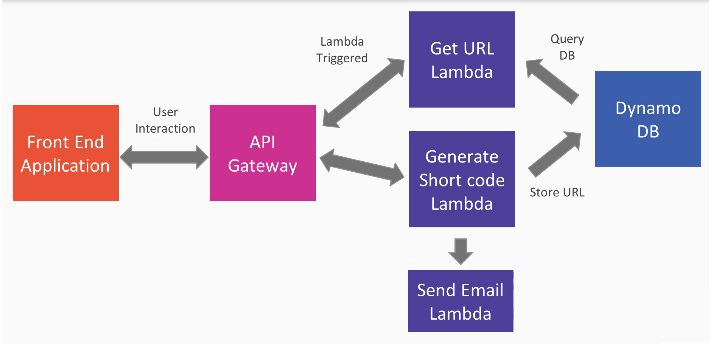

# spring-lambda-url-shortener
I'll develop the wrapper URL shortener using Spring Cloud functions. In this repository I will create a Spring based project with the necessary Spring Cloud dependencies an AWS dependences there all I'll need in this project. Will then set up and configure the database so that I can store the short URL and full URL mappings. The factory builds Spring Cloud functions that create short URLs from the URL. Next I'll build Spring Cloud function that takes that short code and provides the full URL. Will deploy these Spring Cloud functions into AWS, configure the API Gateway to redirect the browser to the real site. I will incorporate the simple email serverless from AWS into our serverless application to send email notifications when people create their short codes, and then finally, I will build the Lambda service to send those email notifications. 

I'll follow the next architecture:

## Reference

I have followed a nice video course for this approach [Building Serverless Applications with Spring and AWS](https://www.packtpub.com/product/building-serverless-applications-with-spring-and-aws-video/9781788393966)

### Commands

curl -H "Content-Type: application/json" localhost:8080/generateShortcode -d '"https://www.g
oogle.com"'
